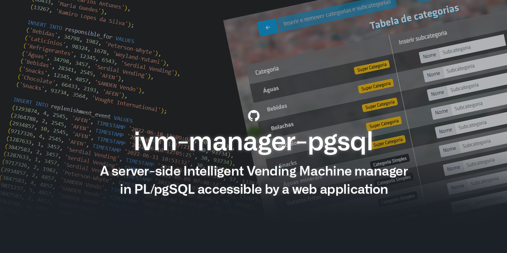

# ivm-manager

IST Databases course's project (LEIC-A 2021/2022). Made by Inês Oliveira, [João Cardoso](https://github.com/joaoncardoso) and [José João Ferreira](https://github.com/jjasferreira).

---

### Table of contents

- [General Overview](#general-overview)
- [Database](#database)
- [Integrity Constraints](#integrity-constraints)
- [Web App](#web-app)
  - [0. How it works](#0-how-it-works)
  - [1. Insertion and removal of categories and subcategories](#1-insertion-and-removal-of-categories-and-subcategories)
  - [2. Insertion and removal of retailers](#2-insertion-and-removal-of-retailers)
  - [3. Listing all restock events of IVMs](#3-listing-all-restock-events-of-IVMs)
  - [4. Listing all subcategories of supercategories](#4-listing-all-subcategories-of-supercategories)
- [Formatting](#formatting)

---

## General Overview

- This project foresees the future existence of vending machines connected to each other in a network and having a centralized database system which is extremely customizable and intuitive. These smart machines, enabled by IoT and called IVMs ("_Intelligent Vending Machines_") for the purpose of this project, will soon be managed by supermarket retailers.

- Besides having an unique serial number and its manufacturer assigned, the IVMs are installed at a retail location, which has an address (name, county and district).

- IVMs have shelves. Each shelf has a number that identifies it and also a certain height.

- Retailers are responsible for replenishing specific categories of IVM products and are identified by their identification number and its unique name. Only one retailer is responsible for a certain category of products within an IVM.

- Within the IVMs, products are displayed on the shelves according to a known plan known as the planogram.
  The planogram determines the shelf, the number of visible fronts and the maximum number of units allowed on the shelf for a certain product.

- Products are identified by a 13-digit numeric barcode known as EAN and have a name. They are organized into categories identified by name. Each product has a main category that must be assigned to it and may optionally belong to more categories.

- There may be categories composed of other categories. That is, the categories may form a hierarchy. The categories made up of subcategories are designated as supercategories. One category can only belong to a maximum of one supercategory. The system must determine, for a supercategory, how many subcategories there are.

- It is necessary to maintain the history of restock events. An event is characterized by the time it occurs and the number of units replaced. The number of replenished units cannot exceed those described in the planogram. All restock events must also keep record of the responsible retailer.

---

## Database

- Our relational database, which follows the PostgreSQL system and was previously hosted by a free university server offered to students enrolled in the Databases course, is currently being hosted and maintained by [ElephantSQL](https://github.com/ElephantSQL), since this server was shut down.

- The [`reset.sql`](./sql/reset.sql) file has every command necessary to eliminate the relationships in force on the database server and also creates the necessary tables with the given attributes and keys.

- The [`constraint.sql`](./sql/constraint.sql) file contains the integrity constraints and triggers needed to ensure that the dependencies are not broken and that any deletion or insertion must follow the rules.

- Finally, the [`populate.sql`](./sql/constraint.sql) file is the one responsible for adding useful data to the database, by inserting tuples into the tables in a way that does not violate any constraint. It is the most important one and must not be compromised or lost, because it contains information regarding the company that is potentially private.

---

## Integrity Constraints

In order for the management system to make sense, to work properly and to ensure that it is coherent and cohesive, we must make use of some restrictions that constraint its logic.

- Since a category cannot be contained by itself, we implemented the [`trigger_category`](./sql/constraint.sql#L5) function, that is executed when inserting or updating some entry in the [`has_other`](./sql/reset.sql#L51) table, through the [`category`](./sql/constraint.sql#L17) trigger. The function checks if the value of _category_ and _super_category_ is equal, in which case it raises an exception, as this situation violates the integrity constraint.

- In order to ensure that the number of replenished units in a restock event cannot exceed the number of units specified in the planogram, the [`trigger_replenishment_units`](./sql/constraint.sql#L25) function was implemented, which is, through the [`replenishment_units`](./sql/constraint.sql#L44) trigger, run when inserting or updating a restock event, and which finds the entry corresponding to the new event in the planogram table, verifying that the number of replenished units of the new event is lower than predicted in the planogram, raising an exception otherwise.

- As a product can only be replenished on a shelf that has one or more of the categories of that product, we implemented the [`trigger_product_on_shelf`](./sql/constraint.sql#L52) function, which when receiving a new input from [`replenishment_event`](./sql/reset.sql#L137), makes a query in which it first gets a table containing all products, the respective categories, and the shelves that contain one of the categories in which the product falls. We assume here that if a product belongs to a category that is a subcategory of another, then that category must have been introduced in the [`has_category`](./sql/reset.sql#L67) table. The function is run when inserting or updating a new value in the `replenishment_event` table, through the trigger [`product_on_shelf`](./sql/constraint.sql#L71).

---

## Web App

This is a web application prototype in Python scripts and HTML pages that allows:

1. [Insertion and removal of categories and subcategories](#1-insertion-and-removal-of-categories-and-subcategories);
2. [Insertion and removal of retailers](#2-insertion-and-removal-of-retailers), with all its products, ensuring that this operation is atomic;
3. [Listing all restock events of IVMs](#3-listing-all-restock-events-of-ivms), showing the number of restock units per product category;
4. [Listing all subcategories of supercategories](#4-listing-all-subcategories-of-supercategories), at all depth levels.

The solution values security, preventing attacks by SQL injections. Furthermore, the atomicity
of operations on the database is ensured.

#### 0. How it works

Access to our IVM management application is possible through [this link](https://ivm-manager.herokuapp.com/).
Inside the directory [`templates`](templates) we can find the HTML files that render the database user interfaces.
Additionally, to make the interaction between the user and the server more intuitive and pleasant to the eyes, we used [Bootstrap](https://github.com/twbs/bootstrap), the CSS framework.

Essentially, the [`app.py`](app.py) script has methods that contain some logic and render the corresponding HTML pages, which, in turn, have several possible actions, which recall the methods of the script, thus ensuring the proper functioning of the application.

By default, the [`index.html`](templates/index.html) page is the root, that is, the first page to be loaded when running the app, and it shows an initial menu with 4 possible choices, which correspond to the features we were asked to implement.
All submenus feature an intuitive navigation bar at the top of the page, which makes it easier to understand the flow of actions in the application.

Whenever the user successfully completes an operation, the corresponding method is activated and its logic is executed, loading the operation's success page with the values that were inserted or removed from the database, so that the user sees the confirmation of what it has done. From this page, it is possible to return to the start menu or the page that immediately preceded it.

On the other hand, if an error is identified in the logic of the [`app.py`](app.py) methods, the [`error.html`](templates/error.html) page is loaded, instead of the intended page, with the text obtained from the bad execution. Additionally, if a HTML page is not able to get the resulting cursors from the queries in the script, the message "_Error: Could not get the data from the database!_" is shown to the user.

### 1. Insertion and removal of categories and subcategories

- In this first submenu, the "_Table of categories_", which contains all the categories found in the database, is initially displayed. From here, we can remove them or insert subcategories to already existing categories, upgrading them into supercategories, if they are have not yet.

> In the categories table, the specification of the category type presented
> in a small tag was added as we think it helps the user to understand more
> easily the hierarchy of categories. This was made possible by carrying out
> two queries, one for each category type, which were both read with a cursor
> to the same table in the HTML page. The transfer of information between the
> Python file and HTML is made using the actions and parameters specified in
> the HTML code tags, as is the case of the forms used in the insertion of a
> new subcategory.

- In addition, in the navigation bar, there is also the option to "_Insert independent category_", which loads a new HTML page, from which we can insert an entirely new and independent category.

> On this page, once again, sending the name of the new category is ensured
> through the use of a form, which allows user keyboard input. The form action
> specifies the method to execute from [`app.py`](app.py#L102), which in turn
> receives the name got from the input as a variable.

### 2. Insertion and removal of retailers

- In this submenu, it is possible to observe the "_Table of retailers_", which corresponds to the default page and which, as you would expect, contains all retailers currently in the database. It is possible to remove all data regarding a certain retailer and its history by pressing the red button that matches it in the table.

> As in any table presented in our application, a query is made in a method
> of the Python script, and the cursor to be traversed in the table is passed
> to the corresponding HTML page using the [`render_template`](app.py#L182)
> function. The remove button triggers a method that removes the indicated
> retailer and that then returns a success page if done successfully.

- Using the navigation bar, it is possible to access the page "_Insert new retailer_", within which it is possible for us to insert a new retailer into the database, indicating its TIN (identification number) and name.

> Once again, the transfer of information is ensured by the forms. The TIN
> values and the name written by the user are stored in variables that are
> later accessed by the method that is triggered by clicking the submit button.

### 3. Listing all restock events of IVMs

- This third feature takes us to the "_Table of IVMs_" page, which contains, for each vending machine, the name of its manufacturer, the serial number and an option to consult its restock events. The latter results on the "_IVM Events_" page, which, in addition to displaying the list of all IVM restock events, shows us a table with the number of units replenished by product category.

### 4. Listing all subcategories of supercategories

This feature corresponds to the last menu option and only contains the "_Table of super categories_" page, which, as the name implies, displays all the super categories in the database. At the top of the table, we find the categories that have, at the time of consultation, associated subcategories, leaving the remaining ones at the bottom. By clicking on the button that follows each table entry, the "_Table of subcategories_" page is opened.

> In the supercategories table, it was only possible to specify which
> categories had subcategories through the use of two queries, one that
> finds those that have relationships with subcategories and another one
> that found those not included in this list. The corresponding cursors
> were sent by the corresponding [function](app.py#L323) in the `app.py`
> file and read into the same table in the HTML file.

---

# Formatting

In order to keep consistency in this project, we use [`black`](https://github.com/psf/black) as a code formatter for Python files.

Alternatively, for the Markdown ones, we use [`prettier`](https://github.com/prettier/prettier).

You are allowed and encouraged to try inserting and removing data into the database, since its reversion to the prototype state is easily guaranteed by the RESET button found in the main page, under the fake Copyright notice.
